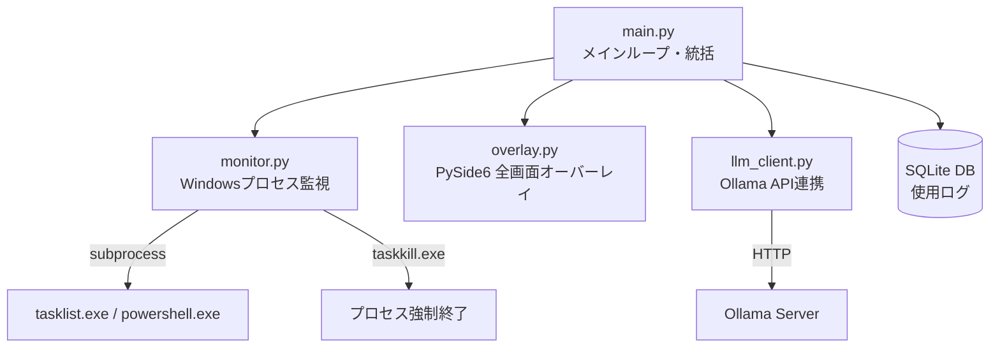

# PC使いすぎ防止・生産性向上アプリ — 実装計画

## 概要

WSL2 (Ubuntu) 上のPythonで動作し、Windowsホスト側のアプリ使用を監視・制限するアプリケーション。
`tasklist.exe` / `taskkill.exe` を `subprocess` 経由で呼び出すことでWSLからWindowsプロセスを操作する。

## アーキテクチャ



## 変更概要

プロジェクトルート: `\\wsl.localhost\Ubuntu-20.04\home\hiroki\Portfolio\pc_limiter\`

---

### コア監視モジュール

#### [NEW] [monitor.py](file:///\\wsl.localhost\Ubuntu-20.04\home\hiroki\Portfolio\pc_limiter\monitor.py)

WSLからWindowsプロセスを監視するコアモジュール。

- **`WindowsProcessMonitor` クラス**
  - `get_running_processes()`: `tasklist.exe /FO CSV /NH` を `subprocess.run` で実行し、CSVをパースしてプロセス一覧を取得
  - `get_active_window()`: `powershell.exe` で `[Win32]::GetForegroundWindow()` → タイトルとプロセス名を取得
  - `kill_process(name)`: `taskkill.exe /F /IM <name>` でプロセスを強制終了
- **`UsageTracker` クラス**
  - SQLiteでアプリごとの累積使用時間を記録
  - `record_usage(process_name, window_title, duration_sec)`: 使用ログをINSERT
  - `get_usage_today(process_name)` → 当日の累積秒数を返す
  - `get_usage_summary()` → 全アプリの当日使用時間サマリー
- **エラーハンドリング**
  - `subprocess` のタイムアウト (5秒)
  - `tasklist.exe` が見つからない場合のフォールバック（`/mnt/c/Windows/System32/tasklist.exe`）
  - CSV解析失敗時のログ出力と空リスト返却

---

### LLM連携モジュール

#### [NEW] [llm_client.py](file:///\\wsl.localhost\Ubuntu-20.04\home\hiroki\Portfolio\pc_limiter\llm_client.py)

Ollama APIを呼び出して「説教メッセージ」を生成する。

- **`OllamaClient` クラス**
  - コンストラクタ: `base_url` (デフォルト `http://localhost:11434`), `model` (デフォルト `phi3`)
  - `generate_scolding(usage_log: str) -> str`: システムプロンプト + 使用ログを送信し、生成テキストを返す
  - `is_available() -> bool`: サーバーの死活確認 (`/api/tags` へGET)
  - タイムアウト: 30秒、接続失敗時はフォールバックメッセージを返す

---

### GUIモジュール

#### [NEW] [overlay.py](file:///\\wsl.localhost\Ubuntu-20.04\home\hiroki\Portfolio\pc_limiter\overlay.py)

PySide6を使った全画面オーバーレイ。

- **`FullScreenOverlay(QWidget)` クラス**
  - ウィンドウフラグ: `FramelessWindowHint | WindowStaysOnTopHint`
  - 半透明黒背景 (`rgba(0, 0, 0, 200)`)
  - 中央に警告テキスト + AI説教メッセージを表示
  - **5秒カウントダウン**: `QTimer` で1秒ごとにカウント、0になるまでキー/マウスを無視
  - カウントダウン完了後に「閉じる」ボタンを表示
  - `show_message(scolding_text)`: オーバーレイを表示しメッセージをセット
  - `closeEvent` / `keyPressEvent` をオーバーライドしてカウントダウン中は閉じれないようにする

---

### メインモジュール

#### [NEW] [main.py](file:///\\wsl.localhost\Ubuntu-20.04\home\hiroki\Portfolio\pc_limiter\main.py)

全コンポーネントを統合するメインループ。

- **`AppConfig` クラス / 定数定義**
  - `BLACKLIST`: 禁止アプリのリスト (例: `["chrome.exe", "Discord.exe", "vlc.exe"]`)
  - `CURFEW_START` / `CURFEW_END`: 深夜帯 (例: `01:00 - 06:00`)
  - `MAX_USAGE_SECONDS`: アプリごとの使用上限 (例: 7200秒 = 2時間)
  - `POLL_INTERVAL`: 監視ポーリング間隔 (例: 5秒)
- **`PCLimiterApp` クラス**
  - `QTimer` で定期ポーリング → `monitor` から情報取得
  - 制限判定ロジック:
    1. 現在時刻がカーフュー時間帯か
    2. ブラックリストアプリが起動しているか
    3. 使用時間が閾値を超えているか
  - 制限発動時: LLMから説教取得 → オーバーレイ表示 → アプリ強制終了
  - `QApplication` のイベントループ内で動作

---

### 依存関係

#### [NEW] [requirements.txt](file:///\\wsl.localhost\Ubuntu-20.04\home\hiroki\Portfolio\pc_limiter\requirements.txt)

```
PyQt6>=6.5.0
requests>=2.28.0
```

---

## 検証計画

### 手動検証

このアプリはWSL2 + Windowsという特殊な環境依存が強いため、自動テストよりも手動検証を中心に行う。

1. **`monitor.py` の単体テスト**
   - WSLターミナルから `python3 -c "from monitor import WindowsProcessMonitor; m = WindowsProcessMonitor(); print(m.get_running_processes()[:5])"` を実行
   - Windows側のプロセスリスト（ブラウザやExplorer等）が取得できることを確認
   - `get_active_window()` でフォアグラウンドウィンドウのタイトルが取得できることを確認

2. **`llm_client.py` の単体テスト**
   - Ollamaサーバーが起動している状態で `python3 -c "from llm_client import OllamaClient; c = OllamaClient(); print(c.is_available()); print(c.generate_scolding('YouTubeを3時間見ました'))"` を実行
   - メッセージが生成されること、サーバー停止時にフォールバックメッセージが返ることを確認

3. **`overlay.py` の単体テスト**
   - WSLgが有効な状態で `python3 -c "from overlay import FullScreenOverlay; from PyQt6.QtWidgets import QApplication; import sys; app = QApplication(sys.argv); o = FullScreenOverlay(); o.show_message('テスト'); app.exec()"` を実行
   - 全画面オーバーレイが表示され、5秒のカウントダウン後に閉じるボタンが出ることを確認

4. **統合テスト (`main.py`)**
   - `python3 main.py` で起動し、ブラックリストアプリ（例: chrome.exe）を起動
   - 制限が発動し、オーバーレイが表示されることを確認
   - ユーザーに起動して確認してもらう

> [!IMPORTANT]
> WSLg (GUI表示) が有効である必要があります。`echo $DISPLAY` で値が返ることを確認してください。
> Ollamaサーバーが未インストールの場合、`llm_client.py` はフォールバックメッセージを使用します。
